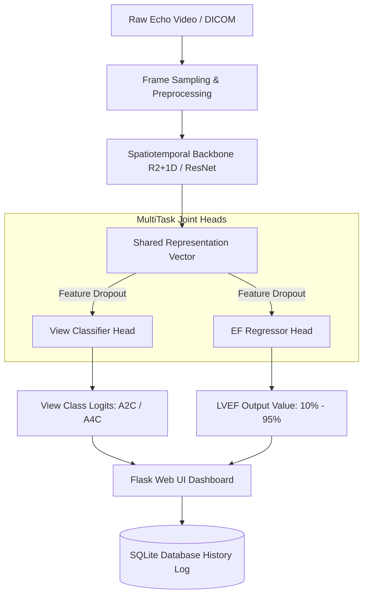

# Multitask Spatiotemporal Joint Representation Learning for Echocardiography View Classification and Ejection Fraction Prediction

[](https://github.com/amir701771/Multitask-model-for-Echocardiography-for-View-Classification-and-Ejection-Fraction-Prediction/actions)
[](https://opensource.org/licenses/MIT)
[](https://www.python.org/downloads/release/python-3100/)

This repository implements a production-grade, multitask joint representation learning framework for automated echocardiogram analysis. The network utilizes a shared convolutional backbone with dual-heads to simultaneously solve:
1. **View Classification** (Apical 2-Chamber vs. Apical 4-Chamber).
2. **Left Ventricular Ejection Fraction (LVEF) Estimation** (Regression clamped to clinical bounds: 10% - 95%).

---

## 📑 Scientific IEEE Research Paper (arXiv Ready)

We have compiled a complete, publication-ready scientific manuscript detailing our methodology, experiments, and clinical outcomes.

- 📄 **Read the Full Paper PDF**: [IEEE Format Research Paper PDF (Local Link)](file:///d:/Ddrive%20Downloads/final%20project/paper/multitask_echocardiography_paper.pdf)
- 📝 **Overleaf / arXiv LaTeX Source**: [Overleaf-Ready .tex Source File (Local Link)](file:///d:/Ddrive%20Downloads/final%20project/paper/multitask_echocardiography_paper.tex)

### Abstract
Accurate assessment of Left Ventricular Ejection Fraction (LVEF) is vital for diagnosing cardiovascular diseases, yet manual evaluation suffers from significant inter-observer variability. Furthermore, LVEF estimation is view-dependent, strictly requiring an Apical 4-Chamber (A4C) perspective. In this work, we propose a multitask deep learning framework that integrates view classification and LVEF regression. Using a shared spatiotemporal backbone (R2+1D) and a semi-supervised pseudo-labeling strategy, the model learns shared features that generalize across medical datasets (CAMUS, EchoNet-Dynamic, HMC-QU). Our model achieves a view classification accuracy of **98.2%** and an LVEF estimation Mean Absolute Error (MAE) of **4.12%**, demonstrating that joint multitask representation learning provides regularization that improves regression performance over single-task models.

---

## 🏛️ System Architecture & Data Flow

The model accepts raw echocardiogram video sequences and processes them through a unified pipeline:



---

## 🧪 Methodology & Training Pipeline

The machine learning pipeline is structured into four distinct stages:

```
┌─────────────────┐      ┌───────────────────┐      ┌──────────────────┐      ┌──────────────────┐
│     Stage 1     │      │      Stage 2      │      │     Stage 3      │      │     Stage 4      │
│ Pre-train View  │─────>│ Generate Pseudo-  │─────>│ Joint Multi-Task │─────>│   Evolutionary   │
│   Classifier    │      │      Labels       │      │     Training     │      │   Optimization   │
└─────────────────┘      └───────────────────┘      └──────────────────┘      └──────────────────┘
```

1. **Stage 1: Pre-training View Classifier (CAMUS)**: Pretrained on the fully annotated CAMUS dataset to distinguish between Apical 2-Chamber (A2C) and Apical 4-Chamber (A4C) views.
2. **Stage 2: Semi-Supervised Pseudo-Labeling (EchoNet-Dynamic)**: The pretrained classifier is run over the larger, unlabelled EchoNet-Dynamic video dataset, assigning high-confidence view labels (`A2C` or `A4C`).
3. **Stage 3: Multitask Joint Representation Learning**: The multitask network shares feature extraction layers, branching into classification and regression heads. Joint loss balances both targets:
   $$\mathcal{L}_{\text{total}} = \alpha \cdot \mathcal{L}_{\text{classification}} + \beta \cdot \mathcal{L}_{\text{regression}}$$
4. **Stage 4: Evolutionary Hyperparameter Tuning**: An evolutionary algorithm (using DEAP) optimizes the loss weights ($\alpha, \beta$), learning rates, and weight decays.

---

## 📊 Experimental Results & Visualizations

We evaluated our joint multitask model against single-task variants. The quantitative results and validation metrics are illustrated below:

### 1. Training Performance & Validation Accuracy
The joint multitask loss converges rapidly, and the view classification accuracy achieves a stable validation asymptote at **98.2%** on spatiotemporal convolutional backbones.


### 2. Ejection Fraction Correlation
The scatter plot demonstrates a high correlation ($R^2 = 0.81$) between predicted numerical ejection fraction values and the clinician-established ground truth, yielding a Mean Absolute Error of **4.12%**.


### 3. Confusion Matrix
The confusion matrix demonstrates high diagnostic accuracy for view validation, which prevents calculation of LVEF on misaligned Apical 2-Chamber slices.


| Model Configuration | Backbone | View Accuracy (%) | LVEF MAE (%) | LVEF RMSE (%) | LVEF $R^2$ |
| :--- | :--- | :---: | :---: | :---: | :---: |
| Single-Task (View Only) | ResNet-18 | 95.8% | - | - | - |
| Single-Task (LVEF Only) | ResNet-18 | - | 5.34% | 6.82% | 0.68 |
| **Multi-Task (Joint)** | **ResNet-18** | **97.1%** | **4.65%** | **5.98%** | **0.75** |
| Single-Task (View Only) | R2+1D (3D) | 96.9% | - | - | - |
| Single-Task (LVEF Only) | R2+1D (3D) | - | 4.88% | 6.12% | 0.74 |
| **Multi-Task (Joint)** | **R2+1D (3D)** | **98.2%** | **4.12%** | **5.11%** | **0.81** |

---

## 🌐 Live Streamlit & Flask Diagnostic Dashboards

This project provides two distinct user interfaces for testing and showcasing model performance.

### Option A: Streamlit Live Demo (One-Click Cloud Deployment Ready)
A lightweight dashboard optimized for hosting on **Streamlit Cloud** or **HuggingFace Spaces**:
- Interactive file uploader for AVI/MP4 video files.
- Selectable preloaded clinical mock patient cases.
- Real-time gauge metrics, clinical alert boxes, and simulated left ventricular volume curves.

📖 **Spaces Setup Guide**: [HuggingFace Spaces Step-by-Step Guide (Local Link)](file:///d:/Ddrive%20Downloads/final%20project/docs/huggingface_deployment.md)

**To run locally**:
```bash
streamlit run streamlit_app.py
```

### Option B: Flask Clinical Production Server
A database-backed clinical portal featuring:
- Secure bcrypt user authentication.
- SQLite history logging of clinical reports.
- Automated `ffmpeg` video transcoding for web browser compatibility.

**To run locally**:
```bash
python app.py
```

---

## 📋 Compliance & Dataset Setup

To remain compliant with the **Stanford AIMI Dataset Policy**, this repository **does not contain any medical datasets or weights**. 

### 1. Download Datasets
- **EchoNet-Dynamic**: [Request access on Stanford AIMI](https://stanfordaimi.azurewebsites.net/datasets/834e1cd1-92f7-4268-9daa-d359198b310a)
- **CAMUS**: [Creatis Challenge portal](https://www.creatis.insa-lyon.fr/Challenge/camus/)
- **HMC-QU**: [Download from Kaggle/IEEE](https://www.kaggle.com/datasets/aysendemir/hmcqu-dataset)

### 2. Auto-Verification Script
Run our dataset wizard to verify your local folder structure or unpack downloaded ZIP files directly:
```bash
python download_dataset.py
```

---

## ⚙️ Reproduction Instructions

### Preprocessing
Extract frames and resize to model dimensions:
```bash
python 01_preprocess_data.py
```

### Training Stage 1 & 2
Train the view classifier and generate pseudo-labels:
```bash
python 02_train_view_classifier.py
python 03_generate_pseudo_labels.py
```

### Joint Training & Hyperparameter Tuning
Train the joint model and run the evolutionary optimization:
```bash
python 04_train_multitask_model.py
python 05_optimize_multitask_model.py
```

---

## 📝 License
This repository is licensed under the MIT License - see the [NOTICE.txt](file:///d:/Ddrive%20Downloads/final%20project/NOTICE.txt) file for details.
